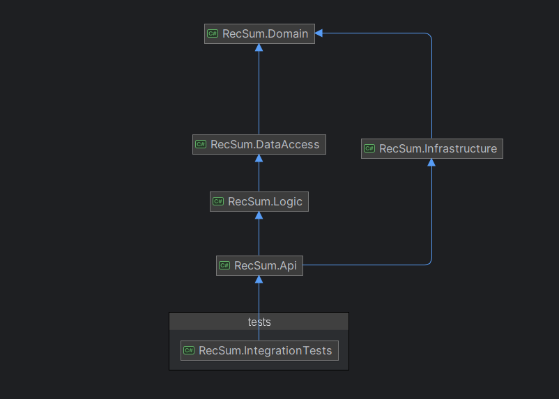

# How to run
- Make sure you have [.net7.0](https://dotnet.microsoft.com/en-us/download/dotnet/7.0) sdk installed
- Use an IDE of choice to run the project normally (VsCode, VisualStudio, Rider)
- OR Use the command line, when working directory is repo root, execute 
```dotnet run --project RecSum.Api/RecSum.Api.csproj```
- Test the swagger UI at http://localhost:5116/swagger/index.html
  - The 2 supported currencies are only VND and USD
- To run the tests execute ```dotnet tests``` at repo's root folder

## Future considerations
- Proper error handling, which emcompasses domain error as well, all within the business logic pipeline
- Work more on the dynamically supported currencies and type-safety
- Explore more summary statistics?
- Country code could be implemented with more 
- More tests for edge cases

## Decisions
- Simple separated of concerns architecture
- This assumes the data is already partitioned by Tenant/Client, so all data ingested belongs to 1 Tenant.
- Imports with updates of existing invoices will skip the updates, as we need some kind of LastUpdatedDate property to properly handle updates
- The currency converter is just a mock service, in reality it should consult some 3rd party api for the ratios, then cache the value

## Documentation
- Project diagram (without transitive dependency)

- **RecSum.Api**: web api project
- **RecSum.Domain**: project for common entities, models, interfaces used throughout the system
- **RecSum.Logic**: where most logic of the system resides
- **RecSum.Infrastructure**: technology-specific implementation of services
- **RecSum.DataAccess**: data access implementation
## Summary
- Time spent: ~5h
